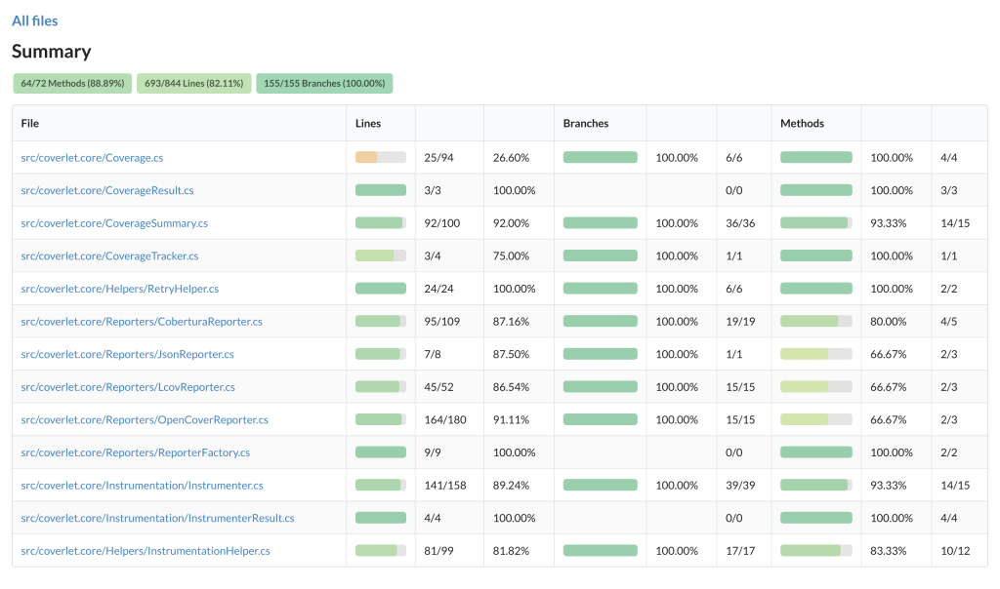
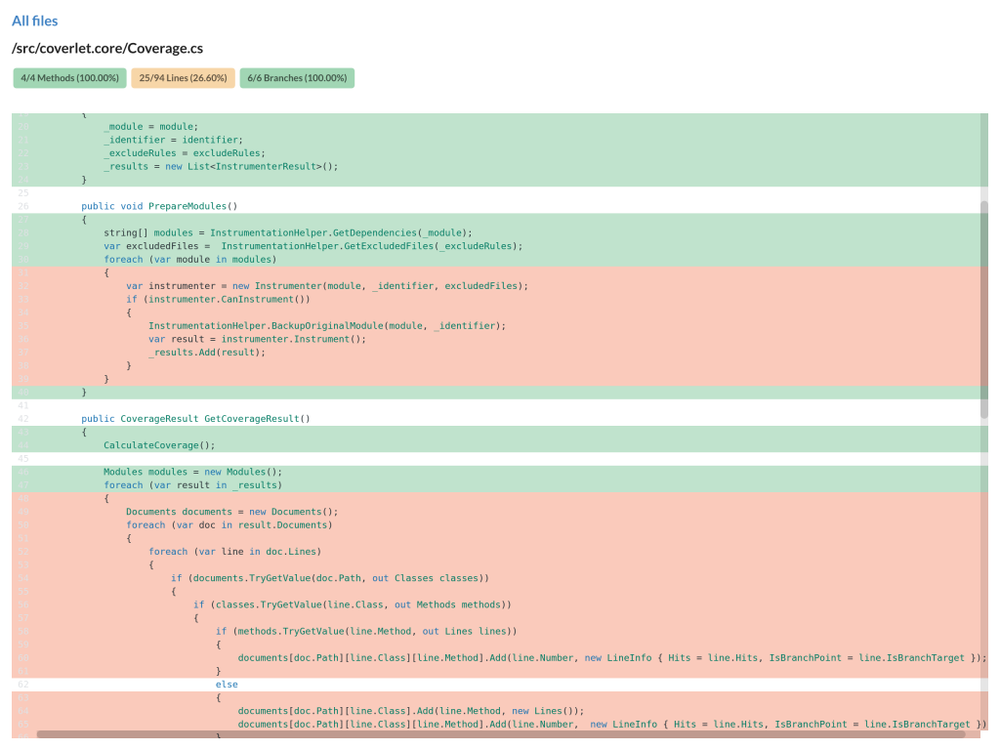

# Coverage Viewer

[![Build Status][travis-image]][travis-url]
[![Coverage][coveralls-image]][coveralls-url]

Turn your code coverage output into a website for exploring your project's coverage statistics more easily:




## Installation

```
npm i -g coverage-viewer
```

## Usage

Currently only tested with C# coverlet JSON output.

CLI Usage:

```
Usage: coverage-viewer <coverageFile> [options]

Options:
  -s             The root of your project's source code directory     [required]
  -o             Where coverage-viewer should write output
  -v, --version  Show version number                                   [boolean]
  -h, --help     Show help                                             [boolean]

Examples:
  coverage-viewer coverage.json -s ./src -o ./coverage
```

Once you've generated the output, serve it with your preferred server:

```
npm i -g httpserver
cd coverage
httpserver
```

## License

MIT © [Forrest Desjardins](https://github.com/fdesjardins)

[travis-url]: https://travis-ci.org/fdesjardins/coverage-viewer
[travis-image]: https://img.shields.io/travis/fdesjardins/coverage-viewer.svg?style=flat
[coveralls-url]: https://coveralls.io/r/fdesjardins/coverage-viewer
[coveralls-image]: https://img.shields.io/coveralls/fdesjardins/coverage-viewer.svg?style=flat
